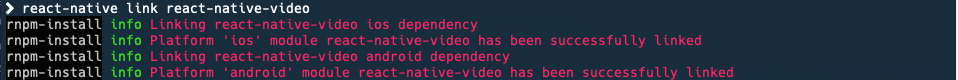

# Curso de React Native de Platzi

En este curso se va a llevar a cabo una aplicación para buscar películas y ver su descripción así como su trailer.

- [Curso de React Native de Platzi](#curso-de-react-native-de-platzi)
  - [Instalacion](#instalacion)
  - [Cambiando el fondo en iOS](#cambiando-el-fondo-en-ios)
  - [API de peliculas a usar](#api-de-peliculas-a-usar)
  - [Seccion para agregar un reproductor de video a la app](#seccion-para-agregar-un-reproductor-de-video-a-la-app)

## Instalacion

Lo primero que debemos tomar en cuenta es tener instaladas las librerías necesarias en tu computadora. Para este proyecto se utilizará una Mac, por tanto lo quedebemos tener instalado, previo a iniciar con todo, es lo siguiente:

1. Node
2. Watchman
   1. En el caso de Watchman, se recomienda instalarlo a través de **Brew**

`brew install watchman`

Ya con lo anterior, debemos instalar (de manera global) el `cli` de *React Native*.

`npm install -g react-native`

Ahora es momento de crear nuestra aplicación, para ello es necesario hacer en tu Terminal:

`react-native <nombre de tu proyecto en camelCase mode>`

Accedes a tu carpeta creada por react-native y puedes arrancar tu app con cualquiera de los siguientes comandos:

`react-native run-ios`

o

`react-native run-android`

**NOTA!** Puede que tu ESLint te marque algunos errores en archivos JavaScript. Corrígelos para continuar trabajando bajo buenas prácticas.

## Cambiando el fondo en iOS

Hay un detalle que ocurre al querer manejar una estructura propia para tu aplicación, y es que al eliminar los componentes por default de `App.js` la pantalla del simulator de iPhone se pone negra.

Para arreglar eso, nos dirijimos al archivo `AppDelegate.m` (lo puedes hacer desde tu editor de código o desde XCode), lo puedes encontrar en:

**./ios/*yourApp*/AppDelegate.m**

Dentro del archivo, busca las siguientes líneas de código:

```objc
  RCTRootView *rootView = [[RCTRootView alloc] initWithBundleURL:jsCodeLocation
                                               moduleName:@"platziVideoApp"
                                               initialProperties:nil
                                               launchOptions:launchOptions];
  rootView.backgroundColor = [UIColor blackColor];
```

Y comenta la última línea:

`// rootView.backgroundColor = [UIColor blackColor];`

## API de peliculas a usar

La API que se usa en este proyecto es [YTS](https://yts.am/api), y el endpoint que se eligió para esto es:

`https://yts.am/api/v2/list_movies.json`

**NOTA!** Hay un momento en la App cuando creamos el archivo `api.js` en el folder `/utils` que la app parece crashearse. Te recomiendo que acabes el proceso que tienes de la app (`ctrl + c`) y lo vuelvas a correr (`react-native run-ios`).

## Seccion para agregar un reproductor de video a la app

En esta sección hay cosas específicas que hacer para poder tener un reproductor de video en la App. En este caso, vamos a instalar una librería de la comunidad [react-native-community](https://github.com/react-native-community) llamada [react-native-video](https://github.com/react-native-community/react-native-video).

Hay que seguir los pasos de instalación ahí descritos:

```bash
npm install --save react-native-video
# Ahora es necesario hacer link con los dispositivos móviles que vamos a usar
# Corremos la siguiente línea, y se hace el link de manera estándard a iOS y Android
react-native link react-native-video
```

Al finalizar el comando, verás una pantalla confirmando la relación, parecida a esta:

